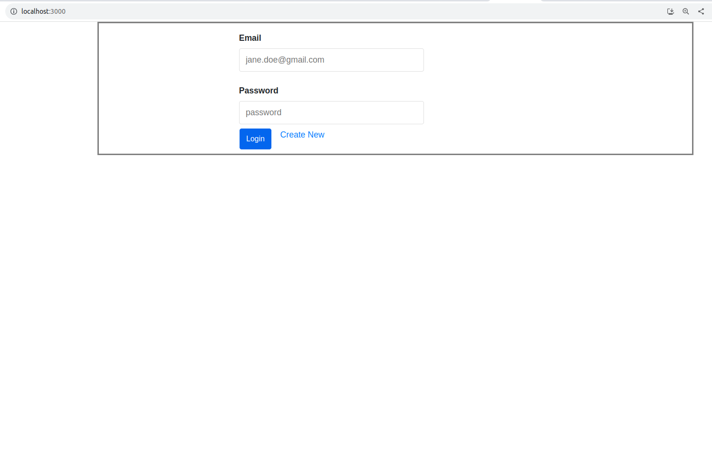
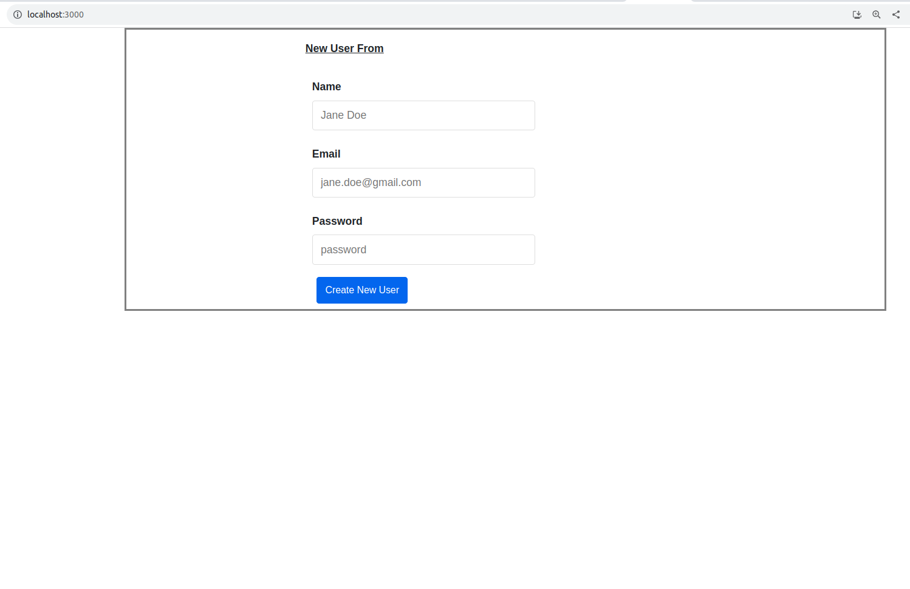
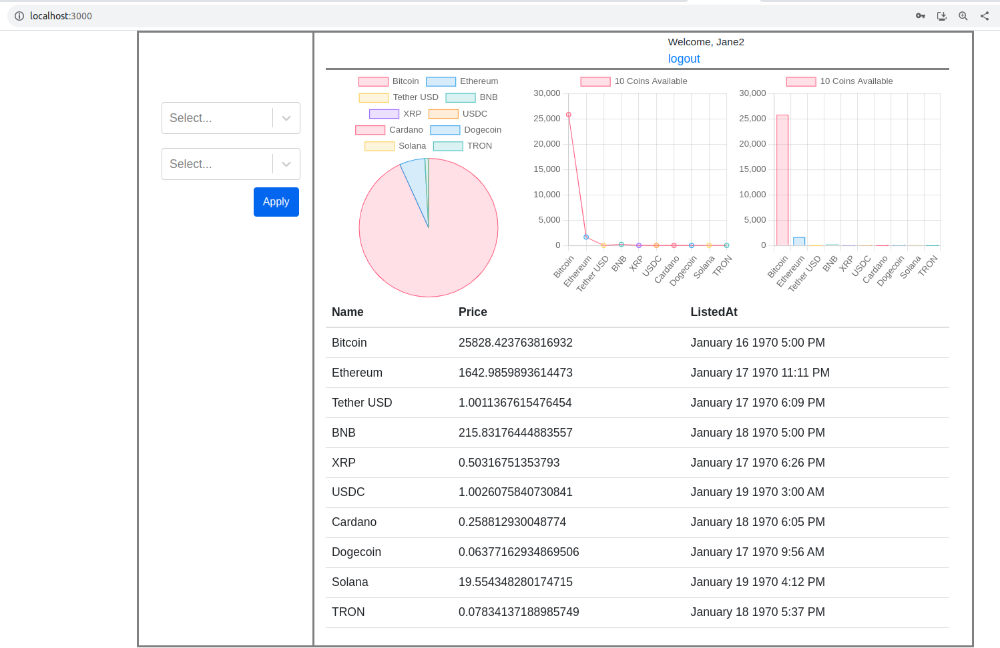
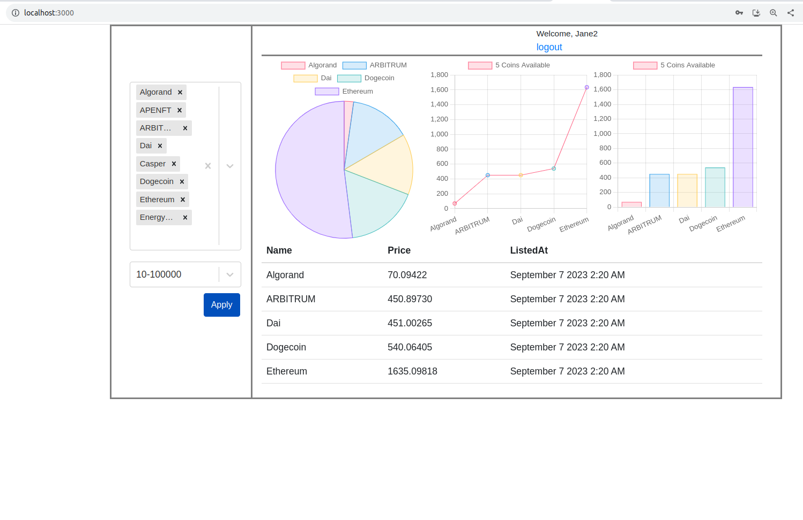

Web application by React Js, Node Js, Postgres SQL
--------------------------------------------------

Run Aplication
--------------
cd to project-directory

```
npm install concurrently
npm run dev
```

Create Database
---------------

```
createuser -U $USER -P express-js
createdb -U $USER express-js
psql -U $USER -c 'GRANT ALL ON DATABASE express-js TO express-jss;'
```

Create table, Insert data conatins in dbprovision.sql file.
-----------------------------------------------------------
cd project-directory
dbprovision.sql

Application ScreenShot
----------------------
-
-
-
-
